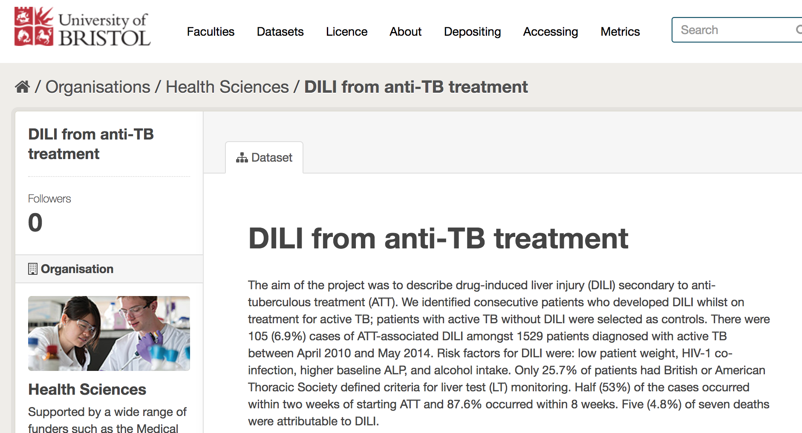
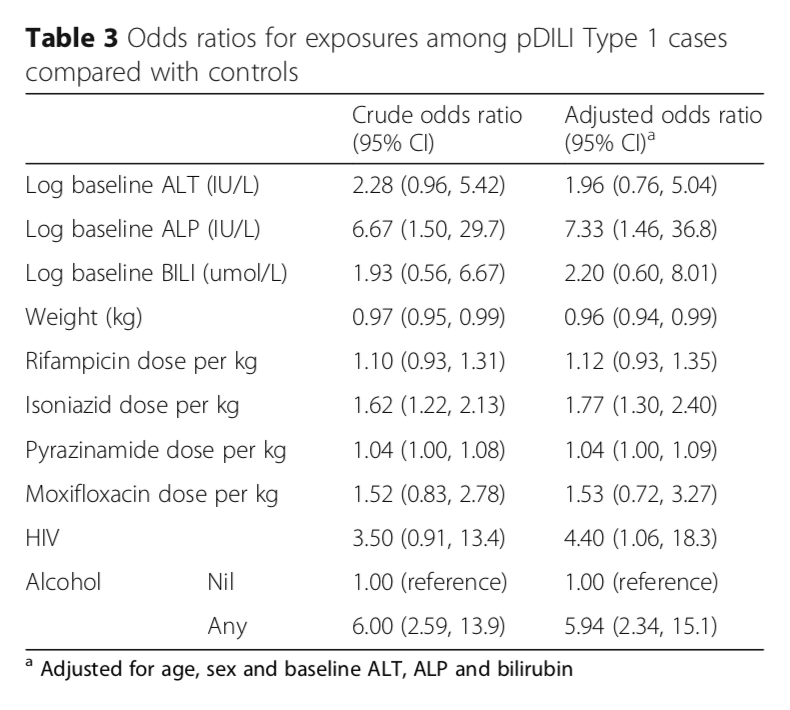

## Project background

* We are medical researchers interested in the risk factors of **Drug Induced Liver Injury** (DILI)
* DILI arises from a reaction to drugs to treat Tuberculosis (TB)
* The data we will use are hospital records taken from a London TB center. 
* The data was hosted on Bristol University's **Research Data Repository**

--- &twocol

## The data

*** =left
* The most important variables are: 
  * The dependent variables: 
    * `pdili` - possible DILI (0 = no, 1 = yes)
    * `t1dili` - type 1 DILI (0 = 0, 1 = yes) (the one we're interested in)

*** =right

  * The indepent variables (risk factors):
    * `log10base_alt`, `log10base_alp`, `log10base_bili` - various blood component concentrations (log scale)
    * `weight` - patient weight (kg)
    * `rifam_dpw`, `ison_dpw`, `pyraz_dpw`, `moxi_dpw` - drugs adminstered
    * `HIV` - HIV status (0 = HIV-, 1 = HIV+)
    * `Alcohol` - whether the patient drank alcohol (0 = no, 1 = yes)

--- &twocol

## The methodology

*** =left

* We have two groups: 
  1. control group, (C) - no DILI
  2. 'treatment' group (T) - type 1 DILI
* Standard methodology for observational studies: 
  1. C vs. T for baseline characteristics (check they're similar)
  2. Logistic regression using potential risk factors as covariates -> adjusted odds ratio (AOR)

*** =right

---

## Our project
The plan for today will be: 

1. Set up an `Open Science Framework` project and plan the analysis. 
2. Understand how and why to make this project *reproducible*. 
3. Get familiar with `git` and `Github` for *version control*. 
4. Understand `RStudio` and IDEs to improve your analysis experience. 
5. Learn how to get and store data. 
6. Understand the concept of *Tidy data*.
7. Do some analysis and upload it to the OSF. 
