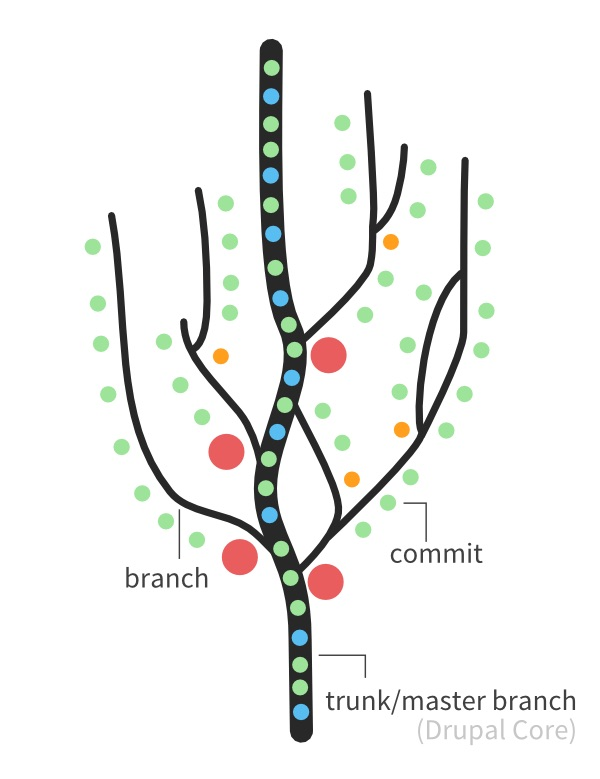

## Overview

* IDEs
* Version control (git)
* Github
* Literate programming
* Open Science Framework

---  &twocol

## IDEs

__Open a new RStudio window__ 
Make sure you have the Console, Terminal, Files, and Source windows visible.

If you're using a Windows machine, and make sure terminals open with Git Bash.

*** =left
__IDEs are Integrated Development Environments__ - they let you do development in one place. 

We're using  today, but I personally rate [Sublime Text](https://www.sublimetext.com/) for all the languages I use (especially Python).

*** =right
__IDEs usually have:__
* Editor
* Compiler or interpreter
* Debugger
* Sometimes extra stuff

---&twocol
## Version Control with Git and GitHub

*** =left
__Git__ is a version control system that's used by ~70% of developers across all programming languages.

__GitHub__ is a platform to which hosts code for collaboration.

*** =right
They help you avoid this sort of thing:
<div class="rimage center"></div>
They also help you keep track of the changes that you've been making to your code and help you collaborate with others.

---&twocol

## Git Glossary

*** =left
__repository__: A repository represents a project - it's a directory where changes will be tracked. A repository is where your project is stored.

__branches__: Branches are different (parallel) versions of the repository. You should make a new branch for each different feature in your code.

__fork__: A fork is your own private version of the repository (stored on GitHub) which you can make changes to without affecting the original version.

__commit__: A commit is a snapshot of your files at a particular time.

*** =right
<div class="rimage center"></div>

---&twocol

## The basics of the git/github workflow

*** =left

* <font size = 3>The __master__ branch should always be in good working order.</font>
* <font size = 3>If you want to add new functionality/work on the code, create and move to (__checkout__) a development __branch__.</font>
* <font size = 3>When you make changes to a local branch that you are happy with, you can decide to take a snapshot of your files (a __commit__) and label them with a message about the changes. To __commit__ you must first decide which files you wish you commit to changing - known as adding the files to to a __staging__ area. Then you __push__ your committed changes from your local copy of the repository to the remote (online) version.</font>
* <font size = 3>After many commits, when you have finished the new functionality for the branch, you can __merge__ it into the master branch/trunk of the tree using (via GitHub) by creating a __pull_request__.</font>

*** =right
<div class="rimage center"></div>
<div class="rimage center"></div>

---

## Git basics continued.


---&twocol

## GitHub "Tour"

*** =left
Let's check out the GitHub website where we have [the repository](https://github.com/RobertArbon/analysis_best_practice) that me and Rob used to collaborate on this workshop. Here you can find all the information for this workshop! 

*** =right
Things to note:
* The README.md
* How to navigate
* How to fork and clone an existing repository
* How to make a new repository

--- 

## Fork the 'analysis_best_practice' repository

* Go to [https://github.com/RobertArbon/analysis_best_practice]. Login and fork the repository.
* Now go to the forked copy of the repository [https://github.com/YOURUSERNAME/analysis_best_practice] and find the green clone button.
* On GitHub, create a new branch called 'workshop-practice' in your fork of the repository.
* Create a new .md file inside 'workshop-practice' and edit it (from GitHub).
* Open a new RStudio window
* File>New Project...>Version Control>Git
* Enter the git@github.com:YOURUSERNAME/analysis_best_practice.git (which you can find on GitHub where the green clone button is) and choose where to store this information. RStudio will always clone the master branch.

Once the project is set up:
* Look inside the files area in RStudio.
* Then go back to GitHub and create a new branch called 'workshop-practice' on GitHub.
* Then go to the terminal window in RStudio and list the current branches using the following command.
```markdown
git branch -a
```
* Change to the participants branch using the following command:
```markdown
git checkout --track remotes/origin/workshop-practice
```
* This creates a new (local) copy of the workshop-practice branch which "tracks" the online branch. This will allow you to later contribute to the repository as well as get the latest versions of it.

Once you've changed branch:
* Notice that the new 'suggestions.md' file has appeared in your directory.
* Wait for me to update the 'suggestions.md' file.
* Close this RStudio session for now!

---
## Markdown

Markdown is a intuitive language which can easily be converted to html. It's a really simple way to style text on for websites.

```markdown
It's very easy to make some words **bold** and other words *italic* with Markdown. 

It's also very easy to  [link to Google!](http://google.com).

It's also how this presentation was formatted!

```
GitHub likes Markdown. It will:
* automatically render READMEs written in Markdown
* render commit and pull request messages written in Markdown.

---

## GitHub "Hello World"


---
## The Git Parable
A condensed excerpt from [the Git Parable]()
---
## GitHub
---
## Markdown 
---
## GitHub Excercise
---
## Making RStudio play with GitHub
---
## Literate programming
---
## RNotebooks
---
## Open Science Framework
---
The  is a 

