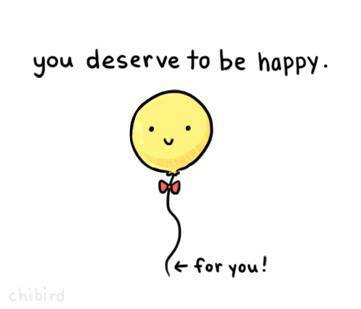

```{r setup, cache = F, echo = F, message = F, warning = F, tidy = F}
# make this an external chunk that can be included in any file
library(knitr)
library(tidyverse)
library(FSA)
library(xtable)
options(width = 100)
opts_chunk$set(eval=T, results = 'markup', include=T, message = F, error = F, warning = F, comment = NA, fig.align = 'center', dpi = 100, tidy = F, cache.path = '.cache/', fig.path = 'fig/')

options(xtable.type = 'html')
knit_hooks$set(inline = function(x) {
  if(is.numeric(x)) {
    round(x, getOption('digits'))
  } else {
    paste(as.character(x), collapse = ', ')
  }
})
knit_hooks$set(plot = knitr:::hook_plot_html)
```

<style>
.title-slide {
  background-color: #750A50
}
.title-slide hgroup > h1, 
.title-slide hgroup > h2 {
  color: #FFFFFF
}
em {
    font-style: italic
}
strong {
    font-weight: bold;
}
</style>

## What is reproducibility?

These are the terms which most people seem to be using:
* __Reproducible__ if you/other people get the same results running the same analysis on the same data.
* __Replicabile__ if a repeat of the experiment (with new data, same analysis) gets the same result.
* __Robust__ if a other people get the same result with different analyses (same data).
* __Generalisable__ if other people get the same result, even with new data and different analyses.

---

## Reproducibility crisis

__Less than 40%__ of replications of well-known Psychology studies had significant results:

```{r, echo=F, out.width='100%'}
include_graphics('fig/psychology-replication-paper.jpg')
```
"Open Science Collaboration. "Estimating the reproducibility of psychological science." Science 349.6251 (2015): aac4716.

Only __11%__ of replications of well-known cancer biology studies had significant results. 

Begley, C. Glenn, and Lee M. Ellis. "Drug development: Raise standards for preclinical cancer research." Nature 483.7391 (2012): 531.

--- &twocol

## Most researchers think there is a problem with reproducibility

*** =left
```{r, echo=F, out.width='100%'}
include_graphics('fig/is-there-a-crisis.jpg')
```

*** =right
Baker, Monya. "1,500 scientists lift the lid on reproducibility." Nature News 533.7604 (2016): 452


--- &twocol

## Most researchers have failed to reproduce a result

*** =left
```{r, echo=F, out.width='100%'}
include_graphics('fig/failed-to-reproduce.jpg')
```

*** =right

Of the 1576 scientists surveyed, __over 70% of scientists surveyed have experienced failure to reproduce other's results__ and __over 50% have failed to reproduce their own results__.

---

## Why did it take us so long to notice?
### Un"FAIR" data and analyses
It used to be harder to share and access data and analyses. FAIR principles describe how data/analyses need to be stored in order for them to be used by others:

* __F__indable: People need to know the data exists (e.g. link to in your paper)
* __A__ccessible: Data needs to be available in a format that humans and computers can understand (e.g. downloadable on the internet)
* __I__nteroperable: The data needs to be in a format that people usually use.
* __R__eusable: Data must be clearly licensed so people know if they're allowed to reuse them.

If data is messy, unlabelled, or doesn't exist no one can check if the result is correct. 

---&twocol

## Why is it happening?
### Data storage mistakes
* High-profile studies have been shown to be wrong because of problems like accidentally deleting columns of excel files, or rewriting important values.

### Data analysis mistakes
* When data analysis is carried out by clicking on buttons in a certain order (using a Graphical User Interface, i.e. GUI), they can accidentally be clicked in the wrong order and give incorrect results. 
* People's code doesn't always do what they think it does.

---&twocol
## Why is it happening?
*** =left
### P-hacking
P-hacking is a catch-all term for making p-values appear smaller than they are. 

__Examples of p-hacking:__
- Collecting samples until your sample size gives you p < 0.05
- Choosing different statistical tests until you get p<0.05
- Running lots of statistical tests and not correcting for mulitple hypotheses

*** =right

```{r, echo=F, out.width='60%'}
include_graphics('fig/forking_paths.jpg')
```

```{r, echo=F, out.width='45%'}
include_graphics('fig/p-curve.jpg')
```

--- &twocol

### HARKing = Hypothesising After Results are Known

*** =left

Instead of trying the same hypothesis with 20 different methodologies, you can get the same effect (finding erroneous "significant" results) by testing 20 different hypotheses and decide what you hypothesised afterwards.

*** =right

```{r, echo=F, out.width='45%'}
include_graphics('fig/jellybean_xkcd.jpg')
```

--- &twocol
## Reasons for p-hacking and HARKing

*** =left
### Publication Bias

* Journals often expect p-values to be reported
* Journals often want low p-values or refuse to publish
* Researchers feel pressured into chasing low p-values

*** =right
### Didn't realise that it was wrong

* Not everyone knows statistics very well (that makes sense)
* Be careful of doing too many statistical tests (it's easy to accidentally p-hack)
* If you're ever unsure about if what you're doing is right, consult a statistician (use ask-JGI or the stats clinic to find one!)

---&twocol

## Why should we be reproducible?

*** =left
* It's the right thing to do - it gives us all better science.
* It's a nicer and easier way to do science.
    * Time-saver when writing up
    * You (or collaborators) can pick up where you left off in the future.
    * Stops you repeating analyses
* Makes you a better researcher (because you know people can check your work, you will too)
* Good for your reputation!

*** =right

```{r, echo=F, out.width='100%'}

```

---

## Discussion! 

We've mentioned some barriers to reproducibility:
* P-hacking
* HARKing
* Un"FAIR"ness.
* Data storage/analysis mistakes

In small groups (~5 people), discuss how you think the 4 reproducibility problems mentioned might affect yours field. 
__(10 minutes)__

Then we will discuss as the whole room 
__(5 minutes)__

--- &twocol
## Reproducibility Solutions
### Make data available

*** =left
Make some data available:
- You can make your original data available
- You can store research data on data.bris. They can even store sensitive data and help you decide who to share it with (DAC)
- You can make anonymised data available
- You synthesise data which is similar to your original data, but does not contain any real subjects.
- Whatever you make available, make sure that it is labelled and described.

*** =right
```{r, echo=F, out.width='50%'}
include_graphics('fig/github.png')
```


```{r, echo=F, out.width='60%'}
include_graphics('fig/osf.jpeg')
```

--- &twocol
## Reproducibility Solutions
### Make analysis available
*** =left
__Scripts__ make analysis available by writing scripts, they:
- Describe exactly what your analysis is and can be shared with others
- Can be written in any programming language (e.g R, Python)
- Always perform in the same order and get the same result
- Those written in non-proprietry software (e.g. R and python, rather than SPSS/Stata) are more accessible.

*** =right
__Literate programming__ = scripts + describing what's happening

Ways to do it:
- Comments
- Documentation
- README files
- Notebooks (e.g. RMarkdown, Jupyter)

--- &twocol
## Reproducibility Solutions
### Version Control

*** =left

* You will want different versions of your scripts/notebooks.
* Nothing is worse than knowing your program worked earlier.
* Having files named `analysis_ver32_final_actually_final.R` is not fun and it's easy to make mistakes.
* When you come back to your work later, you won't be able to remember which is the `for_realsies_final_file.txt`

Version control is a system for avoiding these problems.

*** =right
```{r, echo=F, out.width='70%'}
include_graphics('fig/final_version.jpg')
```

--- &twocol
## Reproducibility Solutions
### Pre-registration
*** =left
*The first principle is you must not fool yourself — and you are the easiest person to fool* - Richard Feynman

```{r, echo=F, out.width='50%'}
include_graphics('fig/feynman.jpg')
```
*** =right

Pre-registering your analyis is saying what analysis you are going to do in advance, including:
* which variables you are going to look at
* what sample size you will aim for
* what you will exclude from your sample
* what variables you are going to correct for

__Pre-registration is only for analyses where you are seeking to confirm a hypothesis__


--- &twocol
## Reproducibility solutions
### [Registered reports](https://cos.io/rr/)

Registered reports are a new model for publishing papers. Instead of applying to journals once you have your results, you apply while after you have made plans for research and analysis, but before you have collected your data.

Extra great for research(ers) because:
* You can publish non-significant results 
* We will all be able to benefit from knowing what __doesn't__ work.

```{r, echo=F, out.width='100%'}

```

--- &twocol

## Draw a "concept map" about reproducibility

*** =left
__Task:__

1. Create concept maps in small groups  (10 minutes)
2. Feed back to the group (5 minutes)

*** =right
__How-to:__

Start by writing down some words that you have heard today in relation to reproducibility, e.g.:
* p-hacking
* publication bias
* pre-registration

Then draw relationships between them, e.g.:
* publication bias --rewards--> p-hacking
* pre-registration --prevents--> p-hacking

---
## Break (15 minutes)
