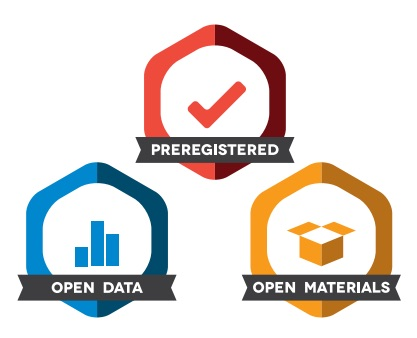

## What is reproducibility?

These are the terms which most people seem to be using:

__Reproducible:__ Your research is reproducible if other people get the same results running the same analysis on your data.

__Replicabile:__ Your research replicates if other people repeat the experiment and their results are consistent with yours. 

___________

Being reproducible is a prerequisite for being replicable; __at a minimum your work should be reproducible__. 

Good practices in data analysis will help you with both (and there are lots of other upsides to them which we'll discuss in a moment).

---

## Reproducibility crisis

__Less than 40%__ of replications of well-known Psychology studies had significant results:

<div class="rimage center"></div>
"Open Science Collaboration. "Estimating the reproducibility of psychological science." Science 349.6251 (2015): aac4716.

Only __11%__ of replications of well-known cancer biology studies had significant results. 

Begley, C. Glenn, and Lee M. Ellis. "Drug development: Raise standards for preclinical cancer research." Nature 483.7391 (2012): 531.

--- &twocol

## Most researchers think there is a problem with reproducibility

*** =left

<div class="rimage center"></div>

*** =right

Baker, Monya. "1,500 scientists lift the lid on reproducibility." Nature News 533.7604 (2016): 452


---&twocol

## Most researchers have failed to reproduce a result
*** =left

<div class="rimage center"></div>

*** =right

Of the 1576 scientists surveyed, __over 70% of scientists surveyed have experienced failure to reproduce other's results__ and __over 50% have failed to reproduce their own results__.

---

## Motivation

* It's the right thing to do - it gives us all better science.
* Helps you to avoid disaster/embarrassment.
* Saves you time in the long run
    * Helps you to write papers/your thesis.
    * Helps you continue your research by remembering what you did, so you or someone else can build on your previous work.
* Makes you a better researcher (because you know people can check your work, you will too)
* Good for your reputation (makes you more trustworthy). 

---

## Types of reproducibility problems

* Data or methods not provided in full.
* Data Storage
* Analysis environment
* P-hacking (and HARKing)

--- &twocol
## Provide your methods and data!

*** =left
In order for your work to be reproducible, at minimum, you must provide enough information for another researcher to be able to reproduce it.

This requires you to __make your data and methods available!__

And __make what you provide usable to others__ by making sure that you store your data (with documentation) publicly wherever possible and provide a full description of your methodology as well as a script that others can run to check your results.

*** =right
If sharing your code sounds scary:
* You could run your scripts through a linter ([lintr](https://cran.r-project.org/web/packages/lintr/index.html) in R - supported in RStudio) first to have it tell you about any errors that can be automatially detected.
* Everyone can improve at this stuff, so I think everyone finds it a bit scary. Share your stuff anyway, please!

<div class="rimage center"></div>

---&twocol

## Data Storage 

*** =left
__Avoid:__
- Accidentally editing data or results
- Forgetting version or origin of data
- Making it hard or impossible for your data to be accessed and understood by others/your future self.

__Avoid because:__
- Overwriting data will affect your results. 
- No one will be able to reproduce your results (including you), even if they are right.

*** =right
__Suboptimal file names:__
* "data.csv""
* "mice friendliness.txt"
* "deprivation_final_actually_for_realsies.txt"
* "bees_measurements.xls"

<div class="rimage center"></div>

---&twocol

## Data Storage 

*** =left

__Anxiety-inducing:__
<div class="rimage center"></div>

*** =right
__Pretty good:__
<div class="rimage center"></div>

* Organise files sensibly. 
* Make data folders read only. 
* Name files well. 
* Include all information you need to re-collect the data in a readme file.
* Store data in text format where possible (easy to share and to version control)

---&twocol

## Analysis environment - Scripts

*** =left
__Avoid:__
- Clicking through a GUI to run analysis.
- Using proprietry software.
- Writing scripts that no one can understand.
- Forgetting what your scripts do.

__Avoid because:__
- Will take you ages to repeat analysis if you need to.
- The order of doing things could change the results (results might be wrong).
- Other people will not be able to reproduce your work.
---&twocol

*** =right

__Solve by:__
- Writing scripts
- Writing scripts in non-proprietry software (i.e. R and python beat STATA and SPSS)
- Writing scripts that are easy to understand: comment your code or embed it in "notebooks" (eg. [Jupyter](http://jupyter.org/) or [R notebooks](https://rmarkdown.rstudio.com/r_notebooks) and name your variables sensibly. 
- Documenting your scripts (README files, comments, documented functions)

---

## Markdown

Markdown is a intuitive language which can easily be converted to html. It's a really simple way to style text on for websites. It's a good language to write your README files in (as well as commits/pull requests on GitHub) and it's also how to write R Notebooks.

```markdown
It's very easy to make some words **bold** and other words *italic* with Markdown. 

It's also very easy to  [link to Google!](http://google.com).

It's also how this presentation was formatted!

```

Try it out!
* Go to [goo.gl/Kx1ys2] (a document I created at hackMD.io - like google docs for Markdown)
* Sign up/log in
* Spend 5-10 minutes playing with Markdown.

---&twocol

## Analysis environment - Version Control

*** =left
__Avoid:__
- Saving over earlier work without being able to get back to it 
- Having files named "analysis_version32_final_actually_final.R"

__Avoid because:__
- Nothing is worse than knowing your program worked a minute ago.
- You won't be able to remember which is the actually_actually_real_final_file.txt

*** =right
<div class="rimage center"></div>

__Solve by:__
- <font color='red'>Using version control (i.e. Git)</font>

---&twocol
## P-values

*** =left

__What does it mean if p < 0.05?__
  * Your result is true?
  * There's a 95% chance your hypothesis is true?
  * There's a 5% (1 in 20) chance that your hypothesis testing has resulted in a false positive assuming that you're using the right measure and all your assumptions are correct?
  * Your result is interesting? 
  * Your result will be easier to publish?

*** =right
<div class="rimage center"></div>

---
## Experiments - Simulation 1

__Rules:__
* Rolling a dice = testing a hypothesis (which isn't true) 
* Rolling a 1 => p<0.05 (a false positive)
* Rolling anything else => p>0.05 (a true negative)

__Simulation 1:__
Assume each you are testing hypotheses on separate datasets. Each dice roll = a new data set.
* Roll a 20-sided dice twice each. 
* How many of you get a false positive?
* How many of you got two?

---&twocol

## Experiments - Simulation 2

Rules are the same as before...

*** =left
__Simulation 2:__
Assume now that I'm the PI of a lab and you are all my PhD students. Each of you are testing the same hypothesis on one dataset but all with slightly different methodologies.
* Roll a 20-sided dice twice each. 
* How many of you get a false positive?
* Did any of you get two false positives?

*** =right
<div class="rimage center"></div>

--- &twocol

## HARKing

*** =left
__HARKing = Hypothesising After Results are Known__

Instead of trying the same hypothesis with 20 different methodologies, you can get the same effect (finding erroneous "significant" results) by testing 20 different hypotheses and decide what you hypothesised afterwards.

*** =right

<div class="rimage center"></div>

---

## HARKing example

<div class="rimage center"></div>

__Bold__ = abstract presented

Text = full description of experiment

---&twocol

## P-hacking

P-hacking is a catch-all term for making p-values appear smaller than they are. 

*** =left
__Examples of p-hacking:__
- HARKing
- Collecting samples until your sample size gives you p < 0.05
- Choosing a different test to get p<0.05

__Solutions to p-hacking:__
* Pre-registration and [Registered reports](https://cos.io/rr/)
* Multi-hypothesis corrections (e.g. [Bonferroni correction](https://en.wikipedia.org/wiki/Bonferroni_correction))
* Simulating data.

*** =right
<div class="rimage center"></div>
<div class="rimage center"></div>

---
## Pre-registration 

Publish intended hypothesis and exact methodology for hypothesis-testing prior to data collection. Can only choose one path in the garden of forking paths. 

There is currently (until the end of the year) a drive/competition (with prizes) for publishing of more preregistering of methodlogies on the [Open Science Framework](https://osf.io/prereg/). 

---&twocol
## Registered Reports

*** =left
[Registered reports](https://cos.io/rr/) are a new model for publishing papers based on pre-registering your analysis. 

You apply to the journal before data collection providing your pre-registration. If you pass peer review at that stage and you stick to what you said you'd do, then you will be able to publish it in that journal.

*** =right
<div class="rimage center"></div>

---&twocol

## Open science badges

*** =left
[Open Science Badges](https://cos.io/our-services/open-science-badges/) are an incentive for researcher's to share data, materials and to preregister their reports. 

They are issued by a growing number of journals (currently ~35).

They help other researchers see that your work is reproducible.

*** =right
<div class="rimage center"></div>

---&twocol

## Summary 

*** =left
__Reproducible research is important because:__
* It saves us from bad science.
* It saves you time when you come back to your work.
* Its good for your reputation (by avoiding disaster, improving your motivation to do good work, and through open science badges, etc).

*** =right
__Main causes of poor reproducibility:__
* (1) Poor data storage
* (2) Poor analysis pipeline
* (3) Lack of sharing data/methods
* (4) Poor use of p-values

(1)-(3) are just a matter of becoming familiar with the tools we're going to be using today. If you have any more questions about (4), you can email us <ask-jgi@bristol.ac.uk>

---
## Practice - making our dice experiment more reproducible.

* Get into pairs/small groups and chat for 2-3 minutes about how the dice experiment we did could be more reproducible, using some of the things we discussed.

---&twocol

## Practice - making our dice experiment more reproducible.

*** =left
__Bronze:__
Write a script to simulate rolling the dice.

__Silver:__
Write an R Notebook to simulate rolling the dice, which will also make it easy to explain how it works.

__Gold:__ 
Publish the Notebook online so that it can be useful to other people.

__Platinum:__
Use version control to track changes to your notebook.

*** =right
Using the following code snippet R as a starting point, create the __Silver__ solution in RStudio, using an R Notebook.
```r
n_repeats = 100
n_rolls = 20
false_pos = 0
for (i in 1:n_repeats){
  rolls = sample(1:20,n_rolls,replace=T)
  if(sum(rolls==1)>0){
    false_pos=false_pos+1
  }
}
pct_false_pos = false_pos/n_repeats
print(pct_false_pos)
```

---

## Take home message:

If you don't do anything else, these three things will massively improve the reproducibility of your work:
* <font size = 20>Write some scripts</font>
* <font size = 20>Share your data and code</font>
* <font size = 20>Use version control</font> (after coffee)
