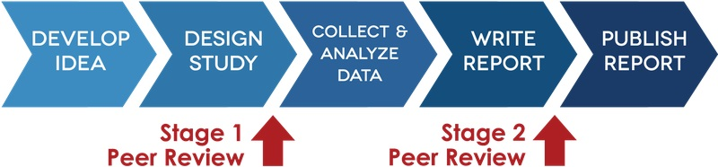

```{r setup, cache = F, echo = F, message = F, warning = F, tidy = F}
# make this an external chunk that can be included in any file
library(knitr)
options(width = 100)
opts_chunk$set(eval=T, results = 'markup', include=T, message = F, error = F, warning = F, comment = NA, fig.align = 'center', dpi = 100, tidy = F, cache.path = '.cache/', fig.path = 'fig/')

options(xtable.type = 'html')
# knit_hooks$set(inline = function(x) {
#   if(is.numeric(x)) {
#     round(x, getOption('digits'))
#   } else {
#     paste(as.character(x), collapse = ', ')
#   }
# })
knit_hooks$set(plot = knitr:::hook_plot_html)
```

## Pre-registration

Pre-registration is a solution to HARKing (Hypothesising After Results are Known). It the practice of saying in advance exactly what analysis you are going to do, including:
* which variables you are going to look at
* what sample size you will aim for
* what you will exclude from your sample
* what variables you are going to correct for

---&twocol

## Benefits of pre-registration

*** =left

Pre-registering has many benefits, including:
> - It prevents HARKing, which you can do unconsciously and accidentally if you don't have a record of exactly what you want to test. This increases your credibility to others and your condience in your results!
> - Proves that you came up with the idea first since you will have timestamped proof of your idea.
> - Helps you write papers/your thesis later.
> - Doesn't get in the way of exploratory research. If you are doing exploratory research, you just have to say that you are doing that, instead of pretending you knew exactly what to test in advance.

*** =right
*The first principle is you must not fool yourself — and you are the easiest person to fool* - Richard Feynman

```{r, echo=F, out.width='50%'}
include_graphics('fig/feynman.jpg')
```


---

## Where and how to pre-register your research

* Use the Open Science Framework to timestamp and archive a pre-registration, so you can prove you made a prediction ahead of time (not deletable).
* Visit AsPredicted.org which provides a form to complete, which will help you structure your pre-registration (making sure you include all relevant information).
* [Registered reports](https://cos.io/rr/): send a journal your method and analysis plan for review before data collection begins and if they like your plan they will agree to publish once the results are in (however they turn out).
* Write your data collection and analysis plan down and post it on your blog.

---

## [Registered reports](https://cos.io/rr/)

Registered reports are a new model for publishing papers. Instead of applying to journals once you have your results, you apply while after you have made plans for research and analysis, but before you have collected your data.

In addition to correcting for HARKing, registered reports also correct for publication bias (positive results are more easily published than negative results)

Extra great for research(ers) because:
* You can publish non-significant results 
* We will all be able to benefit from knowing what __doesn't__ work.

```{r, echo=F, out.width='100%'}

```

---&twocol

## Open science badges

*** =left
[Open Science Badges](https://cos.io/our-services/open-science-badges/) are an incentive for researcher's to share data, materials and to preregister their reports. 

They are issued by a growing number of journals (currently ~35).

They help other researchers see that your work is reproducible.

*** =right
```{r, echo=F, out.width='100%'}
include_graphics('fig/open-science-badges.jpg')
```

---

## Exercise

1. Navigate to https://cos.io/rr/ and see if you can find a journal in your area that allows registered reports. 
2. Navigate to http://help.osf.io/m/registrations, consider the different types of template registration forms and choose which might be most applicable for your research (use the form from AsPredicted.org as a starting point if you aren't sure).
3. Fill in the form for your current or upcoming research. 
