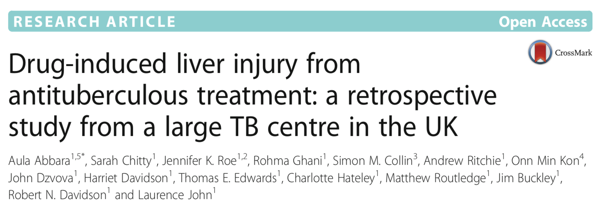
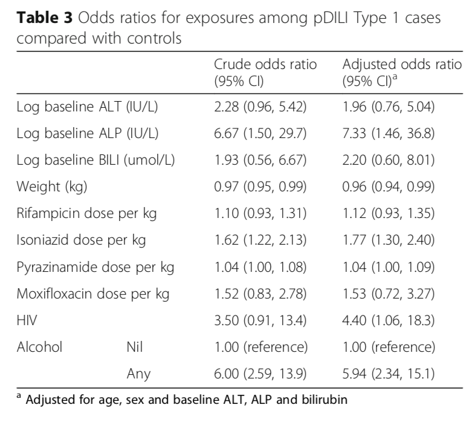

```
## Error in library(tidyverse): there is no package called 'tidyverse'
```

```
## Error in library(FSA): there is no package called 'FSA'
```

## Drug Induced Liver Injury (DILI)

<div class="rimage center"></div>

--- &twocol

## Background

*** =left

- After anti-tuberculosis treatment (up to four different drugs) the liver can become damaged. - There are three types of DILI, type 1 being the focus of this study. 
- The study sought to discover what the risk factors were (from a number of factors). 

*** =right

<div class="rimage center"></div>

---

## Study design

- Retrospective study with >1500 subjects
- The patients with type 1a and 1b (N = 77) DILI were compared to controls (N = 187)
- Difference in variables was compared across groups using summary statistics and statistical tests (Table 2). 
- Logistic regression was used to calculate odds ratios, both crude and adjusted for certain variables (Table 3)

---

## Project

1. Fork the `Github` repo for this course. 
2. Clone your fork onto your local machine. 
2. Checkout the `participant` branch:
```r
$ git fetch
$ git checkout participant 
```

3. Work through the workbook `Exercises` folder
4. Create an `osf.io` project and link the `github` repo. 
5. Upload the pdf reports you've created to the project. 
6. Optional: Tweet the link out and tag @OSFramework saying how much you like it. 
