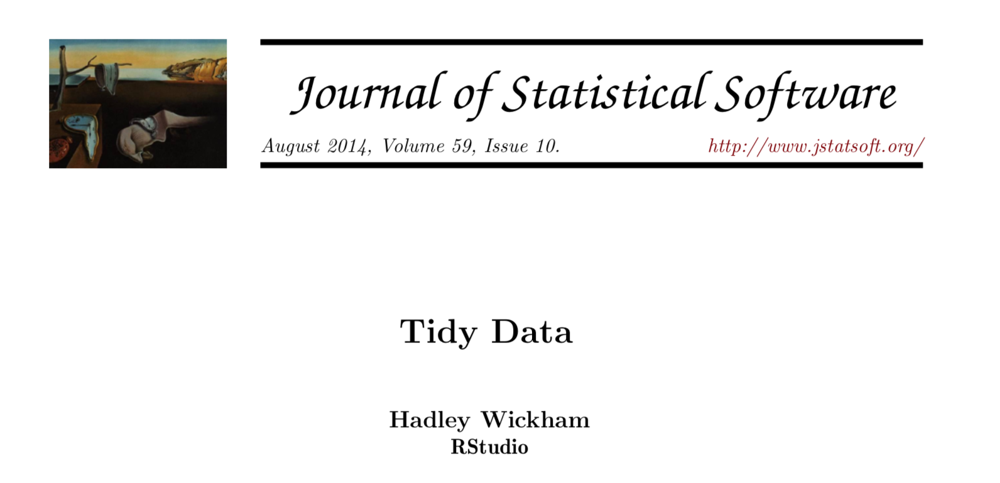

```{r setup, cache = F, echo = F, message = F, warning = F, tidy = F}
# make this an external chunk that can be included in any file
library(knitr)
library(tidyverse)
library(FSA)
library(xtable)
options(width = 100)
opts_chunk$set(eval=T, results = 'markup', include=T, message = F, error = F, warning = F, comment = NA, fig.align = 'center', dpi = 100, tidy = F, cache.path = '.cache/', fig.path = 'fig/')

options(xtable.type = 'html')
knit_hooks$set(inline = function(x) {
  if(is.numeric(x)) {
    round(x, getOption('digits'))
  } else {
    paste(as.character(x), collapse = ', ')
  }
})
knit_hooks$set(plot = knitr:::hook_plot_html)
```


## Tidy data

* Most data sets need **cleaning** before they can be used. 
* **Cleaning** involves:
  * Getting data into tables
  * Getting formats correct e.g., dates and times, units of measurement
  * Grouping observations together in meaningful ways
  * Tidying data: structuring datasets to facilitate analysis
* **Tidy data** is a set of standards for organizig data values within a dataset.

---

## Tidy data
```{r, echo=F, out.width="100%"}

```


---

## Tidy data  - Semantics

* **Values**: entries in a data set
  * Ranged: they have a consistent metric e.g. integers, floats
  * Factors: No consistent metric e.g.
    * Ordinal: ordered e.g. Likert scale
    * Categorical: unordered e.g. male/female/trans
* **Variable**: measures an attribute
* **Observation**: all values measured on a unit (e.g. subject, time) across attributes. 
* Each value belongs to an observation and a variable. 


---

## Tidy data - Semantics quiz

> - Q: Are `height` and `weight` variables or observations?

> - A: They are both variables. 

> - Q: Are `height` and `width` variables or observations?

> - A: They could be both variables **or** observations of a `dimension` variable. 

> - Conclusion: not always easy to make rules for what is a variable and what is an observation. 

---

## Tidy data - the rules

1. Every variable is a column
2. Every observation is a row
3. Every type of observational unit forms a table

* Variable vs observation - if there is ambiguity: 
  * **Wide format**: `area = height * width` then `height` and `width` are variables
  * **Long format**: summarise average height to average width then `height` and `width` are observations. 
  * more on this when plotting. 

--- 

## Tidy data - tools

```{r, echo=F, out.width="100%"}
include_graphics("fig/tidyverse.png")
```

---{.build}

### `tidyr` - example

* Scores after 50 sec, 100 sec,..., 350 sec in a game
* Q: Why isn't this tidy?

```{r, echo=F}
scores <- read.table(header = TRUE, check.names = FALSE, text = "
   Name    50  100  150  200  250  300  350
   Carla  1.2  1.8  2.2  2.3  3.0  2.5  1.8
   Mace   1.5  1.1  1.9  2.0  3.6  3.0  2.5
   Lea    1.7  1.6  2.3  2.7  2.6  2.2  2.6
   Karen  1.3  1.7  1.9  2.2  3.2  1.5  1.9")
scores
```


> - A: the columns are observations!

---

### `tidyr` - example

* use [`gather`](https://tidyr.tidyverse.org/reference/gather.html) to make tidy:

```{r}
scores %>%
  # Gather ALL columns and give default names to columns
  gather() %>%
  head()
```

---

### `tidyr` - example

* use [`gather`](https://tidyr.tidyverse.org/reference/gather.html) to make tidy:

```{r}
scores %>%
  # Gather all columns and give custom names to columns
  gather(key="MyVariable", value="MyValue") %>%
  head()
```

---

### `tidyr` - example

* use [`gather`](https://tidyr.tidyverse.org/reference/gather.html) to make tidy:

```{r}
scores %>%
  # Gather all columns except 'Name' and give custom names to columns
  gather(key="Time", value="Score", -Name) %>%
  head()
```

--- 

### `dplyr` - example

* We may also want to create new variables in order to tidy data. 
* Q: Why isn't our data tidy? 
* Hint: `pdili` indicates whether there is any DILI at all. `t1dili` indicates that it is type 1 (the one we're interested in) and not type 2 or 3. 

```{r}
df <- read.csv("../../data/original/dili_from_anti_TB_treatment.csv")
head(df, 4)
```

> - A: `pdili` and `t1dili` both refer to the same variable (type of DILI). 

---

### `dplyr` - example

* Q: Can we just use `gather` to make it tidy?

> - A: No

---

### `dplyr` - example

* Q: Can we just use `gather` to make it tidy?

* A: No - now there are two rows for every observation. *We need to make a new variable*

```{r}
df %>% 
  gather(key='dili', value='value', c(pdili, t1dili)) %>%
  select(dili, value, 1:10) %>%
  arrange(id) %>%
  head(4)
```

---

### `dplyr` - example

* We can use `mutate` to create a new categorical variable called `dili` with the following levels based on `pdili` and `t1dili`. 
* Easiest way is to add `pdili` to `t1dili`: 
  
| `pdili`  | `t1dili` | `pdili` + `t1dili`  |`dili`  |
|:-:|:-:|:-:|:-:|
| 0  |  0  |  0 |'C' |
| 1  |  1 | 2   |'T1' |
| 1  |  0 | 1   |'T23'|

---

### `dplyr` - example

```{r}
df %>%
  mutate(dili=factor(pdili+t1dili, labels=c('C', 'T23', 'T1'))) %>% 
  mutate(pdili=NULL, t1dili=NULL) %>% # Drop columns
  select(dili, 1:10) %>%
  head(3)
```

---

### Exercises

Navigate to `exercises/analysis.Rmd` and add code chunks to:

1. Load data into a data frame. 
2. Create a new variable called `dili` which has the following levels ('C', 'T1' and 'T23')
3. Delete the `pdili`, `t1dili` AND `id`, `time_to_onset_of_pDILI`


