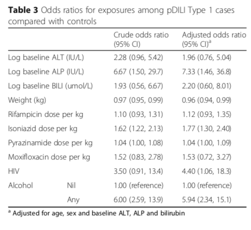

## Almost there! 

* Output of analysis is odds ratios for various risk factors: 

---

## Exercises:

1. In `exercises/analysis.Rmd` add code to the empty code chunks in the sections **Analysis**. 
2. `knit` the document to a `pdf` and upload it to the project on `osf.io`.
3. **EXTENTION**: Complete the `baseline-comparison.Rmd` workbook, `knit` to `pdf` and upload the `osf.io`.  NB: it's long and difficult, but good practice for doing manipulations in R. 

---

## Thank you!

* We'll be here until 5. 
* Please ask us questions. 
* Thanks for your time. 
