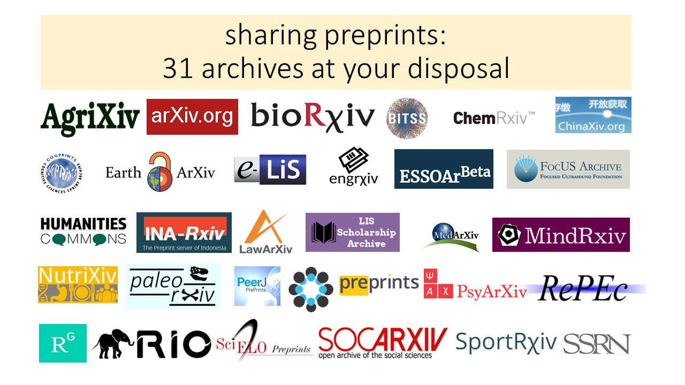

## Outline

* RMarkdown
* Jupyter notebook
* Shiny & Dash
* Pre-print servers
* Github pages

---

## RMarkdown - Formats

* RMarkdown is an extension of markdown. 
* RMarkdown can produce an incredible amount of formats
  1. HTML notebooks
  2. PDF/Latex
  3. Word/ODT
  4. Markdown (obviously)
  5. Presentations (this one)
  6. Journal formats
  7. Books
  8. Interactive dashboards. 
  9. Websites

---

## RMarkdown - Syntax

* The basic idea is that you mix text (markdown) with code chunks, written in run `R` (and `Python`, `bash`, etc. even compiled languages like `Fortran` and `C`). 

* You can run the code and display the results inline. 

* Options are configured in `YAML`  (Yet Another Markup Language) header

* Then you `knit` the package using `knitr` to produce a document

<div class="rimage center"></div>

---

## RMarkdown - exercises

* Create a new markdown document in the following formats: 
  * `html_notebook`
  * `pdf_document`
  * `md_document`
* Select `R Notebook` from the new file button. 
* You should configure your `YAML` as:

```
---
title: "Habits"
author: John Doe
date: March 22, 2005
output: md_document 
---
```

* Put whatever text you like in and then `knit` it. 

---

## Jupyter notebooks

* Similar to RMarkdown
* Can run many different languages. 
* Accessed through web browswer. 

---

## Shiny and Dash

* Shiny (`R`) and Dash (`python`) are both frameworks for publishing interactive web pages. 
* Shiny can also be used for interactive dashboards within R Markdown documents. 
* Search 'Shiny gallery' and 'Dash python gallery'

---

## Preprint servers

* OSF.io 
* Many differnt ones depending on discpline. 
<div class="rimage center"></div>

---

## Github and Github pages

* You can view ordinary markdown on Github repos
* You can also create static web pages using `Jekyll` and Github. 
